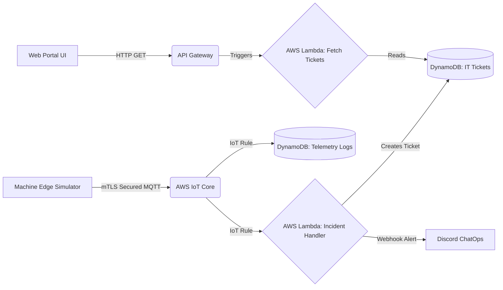

# Serverless Manufacturing Downtime Alert System

> **Recruiters & Hiring Managers**: Welcome! This project was built to demonstrate an enterprise-grade Digital Transformation (DX) architecture tailored for modern manufacturing. It proves the ability to design secure cloud infrastructure, implement ChatOps, develop predictive maintenance algorithms, and build full-stack internal IT tools.

## 🚀 Business Value & The Problem Solved

In manufacturing, machine downtime is incredibly costly. Traditionally, responding to equipment failures relies on manual observation and manual IT ticketing.

**The Solution:** This project simulates a fully automated **Predictive Maintenance & IT Ticketing System**.
By leveraging Edge computing and Serverless Cloud technology, the system analyzes telemetry data in real-time. It detects anomalies and gradual wear-and-tear, instantly alerts the maintenance team via Discord (ChatOps), and automatically generates an IT Helpdesk ticket displayed on a custom Web Portal.

## 🏗️ Phase 2 Architecture

## 🌟 Key Technical Features

1. **Predictive Maintenance Simulation:** The edge devices simulate gradual bearing wear (rising vibration). The cloud detects this before failure and issues a proactive maintenance ticket.
2. **ChatOps Integration:** Replaces old-fashioned emails by sending beautifully formatted rich-embed Webhooks directly to a Discord IT channel.
3. **Full-Stack DX Web Portal:** A premium, glassmorphic HTML/CSS/JS dashboard that interacts with a serverless API (API Gateway + Lambda) to display live support tickets dynamically.
4. **Secure Edge Connectivity (IoT):** The simulated machines connect to AWS IoT Core using X.509 Certificates and mutual TLS (mTLS).
5. **Event-Driven Serverless Compute:** Utilizes AWS Lambda for processing anomalous data and serving API requests with near-zero operational cost.

## 🛠️ Usage

To see this project in action, a detailed setup guide (`AWS_SETUP_GUIDE.md`) is provided in this repository for step-by-step replication in any AWS environment.
